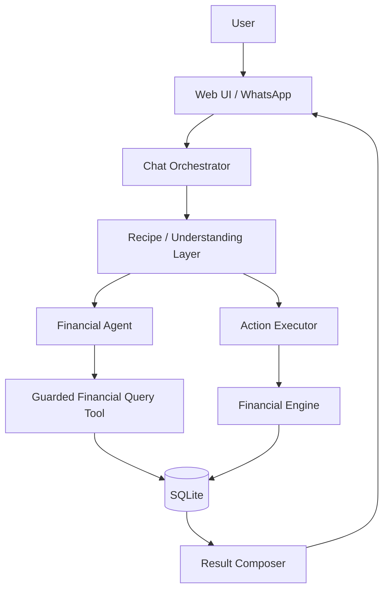
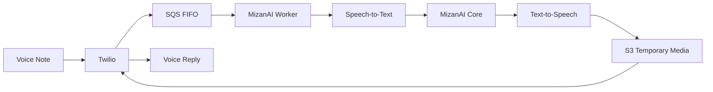
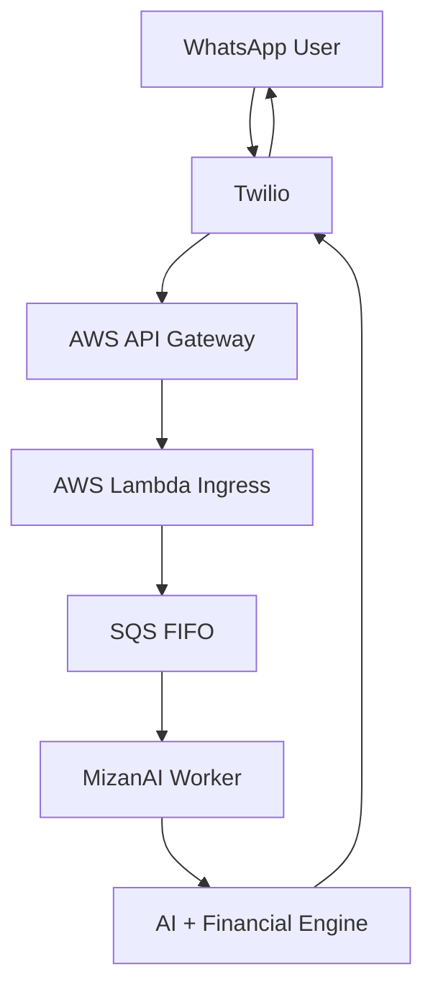
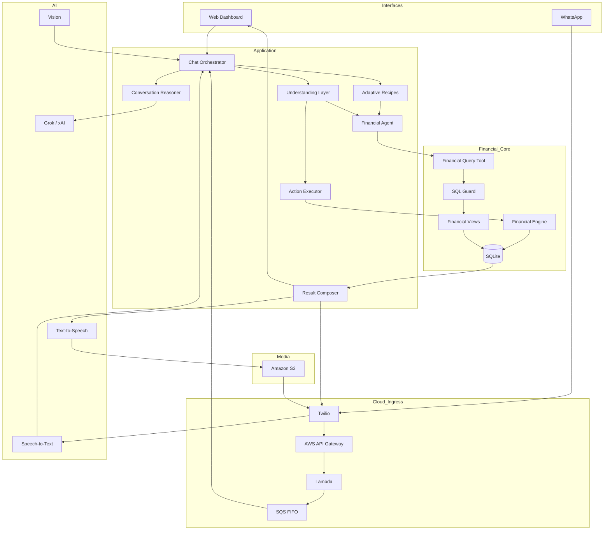

# MizanAI

> **An AI-native personal finance assistant engineered around one core principle:**
>
> **LLM owns meaning. Financial Engine owns truth.**

MizanAI is a personal finance system that combines **Generative AI, deterministic financial computation, multimodal AI, data analytics, and cloud messaging architecture**.

The project was built around one practical engineering question:

**How do you make an AI assistant conversational enough to understand messy human language, while keeping financial results deterministic, auditable, and protected from LLM hallucinations?**

MizanAI solves that by separating semantic reasoning from financial truth.

The LLM understands what the user means.  
Python and SQL decide what is financially true.

---

## Why MizanAI Is More Than a Chatbot

Most AI finance demos stop at:

```text
User → LLM → Answer
```

MizanAI does not.

The system uses the LLM as a reasoning and interpretation layer, then routes financial operations through deterministic application logic, guarded database access, structured contracts, and explicit financial semantics.



That architectural separation is the heart of the project.

---

# Engineering Highlights

## 1. LLM Reasoning Separated From Financial Truth

MizanAI intentionally does **not** allow the LLM to become the source of truth for balances, totals, transaction history, or financial calculations.

The AI layer is responsible for:

- understanding user intent
- resolving conversational references
- interpreting financial meaning
- choosing the correct operation
- extracting structured parameters
- producing natural-language responses

The financial layer is responsible for:

- transaction persistence
- balance calculations
- spending aggregation
- date filtering
- financial classification
- database validation
- deterministic execution

This reduces hallucination risk and makes financial answers reproducible.

---

## 2. Explicit Financial Semantics

A debit is not always an expense.

MizanAI models the **financial nature** of a transaction instead of relying only on raw debit/credit direction.

Supported semantic classes include:

```text
expense
income
transfer
refund
investment
debt
cash_movement
adjustment
unknown
```

This allows the engine to reason correctly about cases such as:

- own-account transfers not being counted as spending
- refunds reducing spending
- ATM withdrawals not automatically being treated as expenses
- investments being separated from consumption
- debt and repayments being modeled separately
- credit-card related movements avoiding naive double-counting

The goal is to make analytics financially meaningful instead of simply summing negative transactions.

---

## 3. Agentic Financial Query Architecture

MizanAI includes a financial agent capable of answering open-ended financial questions while still operating inside controlled boundaries.

Instead of giving the model unrestricted database access, the system uses:

- structured financial contracts
- a dedicated financial query tool
- guarded SQL execution
- approved financial views
- deterministic result retrieval

The agent can reason about a question such as:

```text
كم صرفت على القهوة هذا الشهر؟
```

while the actual numbers still come from the financial database rather than the model.

The architecture is designed so the AI can be flexible **without making the data layer flexible in unsafe ways**.

---

## 4. Structured LLM Contracts

MizanAI uses structured data contracts between AI reasoning and application execution.

The project contains explicit models for areas such as:

```text
ActionPlan
QuerySpec
UnderstandingResult
ConversationResult
FinancialAgentResult
RecipeExecution
LLMPlan
```

Instead of passing loosely formatted text between components, the system converts AI decisions into structured application objects.

This makes the AI workflow easier to validate, test, debug, and evolve.

---

## 5. Conversation Reasoning

Users rarely speak in isolated commands.

A real conversation can look like:

```text
User: كم صرفت هذا الشهر؟
User: طيب على القهوة؟
User: وآخر عملية؟
```

MizanAI includes a conversation layer that helps resolve follow-up references and preserve conversational context before financial execution.

The architecture separates:

```text
Conversation understanding
        ↓
Financial intent
        ↓
Deterministic execution
        ↓
Natural-language response
```

This keeps conversational reasoning separate from the financial engine itself.

---

## 6. Adaptive Recipe Layer

Not every user request needs the same amount of LLM reasoning.

MizanAI includes a recipe system with components for:

```text
matching
routing
compilation
execution
period resolution
learning repository
result composition
```

The purpose is to recognize reusable financial interaction patterns and execute them through a more targeted path when possible.

This avoids treating every message as a completely open-ended LLM problem and creates a cleaner path toward lower latency, lower token usage, and more predictable execution.

---

## 7. Receipt Understanding With Vision

MizanAI supports receipt images.

The receipt pipeline can extract structured information such as:

```json
{
  "merchant": "AL NAHDA CAFE",
  "total_amount": 49.45,
  "currency": "SAR",
  "transaction_date": "2026-09-25",
  "receipt_number": "104582"
}
```

The extracted transaction is treated as a **candidate**, not immediately as financial truth.

The user can then:

- confirm the full amount
- specify a partial amount
- correct the value
- cancel the transaction

Only after confirmation does the normal financial write path take over.

This keeps multimodal AI extraction separate from trusted financial persistence.

---

## 8. Voice-Native Financial Interaction

MizanAI also includes a voice pipeline.



The current implementation supports:

- voice-note ingestion
- speech transcription
- normal MizanAI reasoning
- generated voice responses
- temporary S3-hosted media
- WhatsApp delivery through Twilio

Text messages remain text responses, while voice interactions can stay voice-native.

---

## 9. AWS + Twilio Messaging Architecture

MizanAI can run locally, but it also contains a cloud messaging architecture for WhatsApp.



The messaging architecture was designed around asynchronous processing rather than running the full AI workflow inside the webhook request.

### Why SQS FIFO?

The queue provides:

- durable message handoff
- ordered processing
- per-user message grouping
- decoupling between webhook latency and AI execution
- retry support
- dead-letter queue handling

Messages are grouped by sender so rapid WhatsApp messages can remain ordered for the same user.

---

## 10. Idempotent Financial Writes

Duplicate delivery is a real concern in webhook and queue-based systems.

MizanAI includes idempotency handling for inbound financial actions.

External message identifiers are propagated into the execution context and used when generating transaction idempotency keys.

This protects the financial write path from creating duplicate transactions when the same external message is processed more than once.

The outbound Twilio path also includes persistent message tracking to reduce accidental duplicate responses.

---

## 11. Database Views for Financial Analytics

The data layer exposes controlled financial views rather than forcing AI components to understand raw storage internals.

Examples include financial views for:

```text
transactions
concepts
financial snapshot
```

This gives the analytics and AI layers a cleaner semantic interface while allowing the underlying schema to evolve independently.

---

## 12. Financial Analytics Dashboard

MizanAI includes a custom frontend for financial monitoring and AI interaction.

The interface includes:

- current balance
- financial health overview
- spending analytics
- transaction activity
- customizable dashboard cards
- persistent AI chat
- activity history
- responsive interaction states

The frontend is intentionally lightweight and implemented using:

```text
HTML
CSS
JavaScript
```

without requiring a large frontend framework.

---

## 13. Local-First Setup Wizard

A project is not useful if only its author can run it.

MizanAI includes an onboarding wizard that prepares the environment for a new user.

Run:

```bash
python setup.py
```

The wizard supports:

```text
Local mode
AWS + WhatsApp mode
Fresh financial profile
Demo dataset
Supported bank-statement import
```

It generates local configuration while keeping credentials outside the repository.

Users provide their own API keys and infrastructure credentials.

---

## 14. Bank Statement Import

MizanAI includes support for importing a supported **Al Rajhi Bank statement** into the financial data layer.

The importer performs parsing and validation before persistence rather than treating the statement as arbitrary text.

The onboarding flow can use statement data to bootstrap a financial profile without manually entering every historical transaction.

---

# System Architecture



---

# Example Interactions

### Ask about spending

```text
كم صرفت هذا الشهر؟
```

### Ask a follow-up

```text
طيب على القهوة؟
```

### Create a transaction naturally

```text
دفعت 25 ريال في ستاربكس
```

### Analyze spending behavior

```text
حلل أسلوب صرفي هذا الشهر
```

### Ask about recent activity

```text
ايش آخر عملية عندي؟
```

### Use a receipt

Send a receipt image through the supported interface, review the extracted transaction, and confirm it before saving.

---

# Project Structure

```text
MizanAI/
├── app/
│   ├── agent/
│   │   ├── finance_query_tool.py
│   │   ├── financial_agent.py
│   │   └── sql_guard.py
│   │
│   ├── ai/
│   │   ├── prompts/
│   │   ├── conversation_reasoner.py
│   │   ├── grok_client.py
│   │   ├── grok_voice.py
│   │   ├── receipt_parser.py
│   │   ├── recipe_result_composer.py
│   │   ├── result_composer.py
│   │   └── understanding.py
│   │
│   ├── api/
│   ├── application/
│   ├── contracts/
│   ├── core/
│   ├── infrastructure/
│   │   ├── database/
│   │   └── messaging/
│   │
│   ├── modules/
│   │   ├── analytics/
│   │   ├── conversations/
│   │   ├── taxonomy/
│   │   └── transactions/
│   │
│   ├── onboarding/
│   └── recipes/
│
├── frontend/
│   ├── activity/
│   ├── css/
│   └── js/
│
├── scripts/
│   └── maintenance/
│
├── tests/
│
├── main.py
├── run.py
├── setup.py
├── requirements.txt
├── .env.example
└── README.md
```

---

# Tech Stack

| Area | Technologies |
|---|---|
| Generative AI | Grok / xAI, structured LLM outputs |
| Agentic AI | Financial Agent, tool execution, structured plans |
| Multimodal AI | Vision, Speech-to-Text, Text-to-Speech |
| Backend | Python, FastAPI |
| Financial Data | SQLite, SQL, semantic financial views |
| Messaging | Twilio WhatsApp |
| AWS | API Gateway, Lambda, SQS FIFO, S3 |
| Frontend | HTML, CSS, JavaScript |
| Validation | Structured contracts, guarded SQL, deterministic execution |
| Testing | Financial, agent, recipe, voice, receipt, and read/write flow tests |

---

# Running the Project

## 1. Clone the repository

```bash
git clone https://github.com/OmarIAlzoubi/MizanAI.git
cd MizanAI
```

## 2. Create a virtual environment

### Windows

```bash
python -m venv .venv
.venv\Scripts\activate
```

### Linux / macOS

```bash
python -m venv .venv
source .venv/bin/activate
```

## 3. Install dependencies

```bash
pip install -r requirements.txt
```

## 4. Run the setup wizard

```bash
python setup.py
```

The setup wizard can configure a local environment and initialize the project using fresh data, demo data, or a supported statement import.

## 5. Start MizanAI

```bash
python run.py
```

---

# Environment Configuration

MizanAI does not include private API credentials.

Copy:

```text
.env.example
```

to:

```text
.env
```

or let the setup wizard generate it.

Example:

```env
XAI_API_KEY=
XAI_MODEL=grok-4.7

MIZAN_MODE=local

TWILIO_ACCOUNT_SID=
TWILIO_AUTH_TOKEN=

AWS_REGION=eu-central-1
AWS_PROFILE=mizanai-worker

MIZAN_SQS_QUEUE_URL=
MIZAN_VOICE_BUCKET=
```

Every user supplies their own credentials.

The real `.env`, local databases, generated media, AWS build artifacts, and personal financial data are excluded from Git.

---

# Testing

The repository includes tests for multiple layers of the system, including:

```text
financial query execution
financial agent behavior
transaction creation
conversation understanding
recipe compilation
recipe matching
recipe execution
receipt parsing
voice processing
voice media storage
database read/write flows
```

Example:

```bash
pytest
```

Individual engineering tests can also be run directly while developing a specific component.

---

# Design Principles

### 1. AI interprets. Code verifies.

LLMs are used where ambiguity exists.  
Deterministic code is used where correctness matters.

### 2. Financial truth never comes from generated text.

Balances, spending totals, transaction history, and analytics are calculated from the data layer.

### 3. Multimodal input is treated as untrusted until confirmed.

Receipt and voice understanding can propose actions, but persistence goes through the normal financial execution path.

### 4. Cloud messaging is asynchronous.

Webhook ingestion and AI processing are intentionally decoupled using SQS.

### 5. Duplicate messages should not create duplicate money movements.

External message identity is propagated into financial write idempotency.

### 6. The architecture should work locally before requiring cloud infrastructure.

MizanAI can run as a local application and optionally expand into the AWS + WhatsApp architecture.

---

# What This Project Demonstrates

MizanAI was built as an engineering-focused AI project rather than a thin wrapper around an LLM API.

It demonstrates practical work across:

- Generative AI architecture
- agentic AI workflows
- structured LLM outputs
- deterministic tool execution
- conversational state handling
- financial data modeling
- SQL analytics
- multimodal AI
- receipt vision
- speech pipelines
- idempotent message processing
- asynchronous cloud architecture
- AWS integration
- Twilio integration
- frontend/backend integration
- local developer onboarding
- testing and modular software design

---

# Status

MizanAI is an actively developed portfolio project.

The current goal is not to replace a bank or regulated financial platform. It is an engineering demonstration of how conversational AI can be connected to a deterministic personal-finance engine in a reliable and extensible way.

---

# Author

**Omar Al-Zoubi**

AI Engineer focused on building practical systems around:

**Generative AI · Agentic AI · Multimodal AI · LLM Systems · AI Infrastructure**

GitHub: [OmarIAlzoubi](https://github.com/OmarIAlzoubi)

---

# License

MizanAI is source-available under the **PolyForm Noncommercial License 1.0.0**.

You may view, use, modify, and distribute the software for permitted non-commercial purposes.

**Commercial use of MizanAI, including commercial use of modified versions or derivative works based on this software, requires separate written permission from the copyright holder.**

Copyright © 2026 Omar Al-Zoubi.

See [LICENSE](LICENSE) for the complete license terms.
